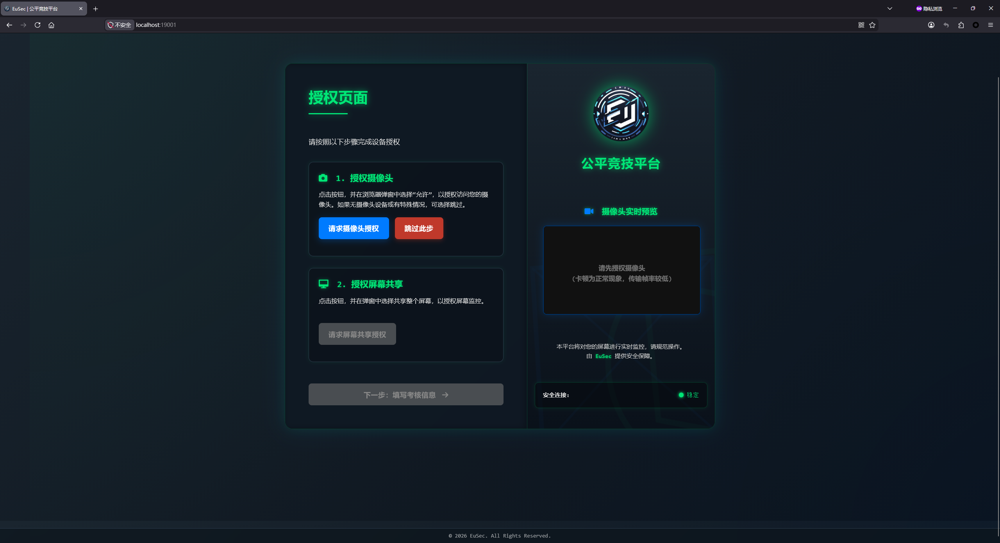
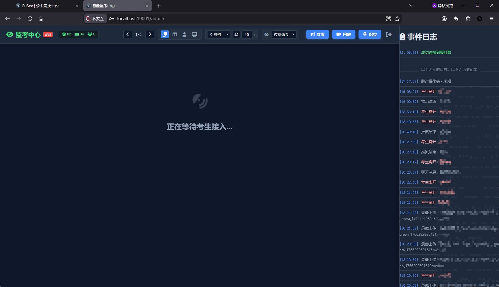
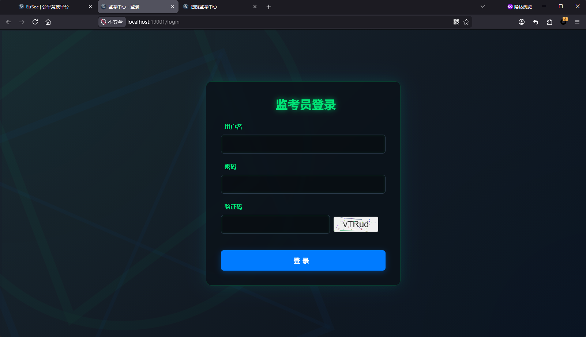
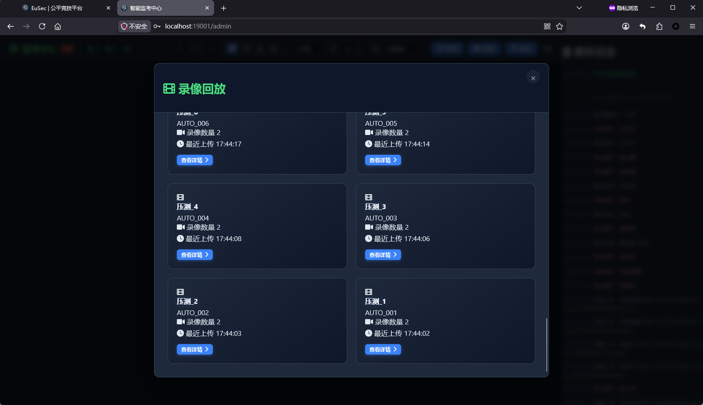
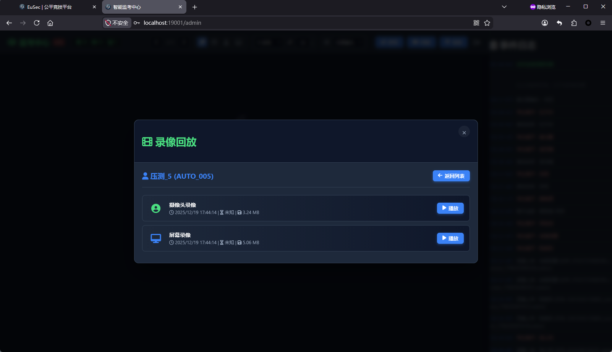

# FairGuard（公平竞技监考系统）


## 项目简介

FairGuard（公平竞技监考系统）是一套基于 Node.js、Express、Socket.IO、mediasoup 和 MySQL 的在线监考系统，支持用户端授权、实时音视频上报、屏幕共享、监考员实时查看、聊天沟通、录制保存、事件日志与数据库持久化。

本仓库已经整理为适合开源发布的结构，支持 Docker Compose 一键启动，也支持直接使用 Node.js 运行。

## 系统能力

- 用户端：摄像头授权、屏幕共享、身份信息登记、聊天、考试过程提示、录制上传
- 监考端：实时预览、学生列表、监考聊天、广播消息、日志查看、录制回放、指纹信息查看
- 后端：HTTPS + HTTP 重定向、Socket.IO 会话共享、mediasoup WebRTC 转发、MySQL 持久化
- 部署：支持 Docker Compose、独立 Node.js 运行、可配置证书与数据库

## 系统架构

### 1. 前端层

- `public/index.html` + `public/script.js`
  - 用户端主页面
  - 负责授权引导、采集、状态提示、录制上传流程
- `views/monitor.html` + `public/monitor.js`
  - 监考端控制台
  - 负责实时监控、聊天、广播、日志和录制管理
- `views/admin-login.ejs`
  - 监考员登录页

### 2. 服务层

- `server/index.js`
  - 主入口
  - 提供 HTTPS/HTTP 服务、路由、Socket.IO、mediasoup worker/router/transport 管理、录制接口、登录会话
- `server/config.js`
  - 统一管理运行时配置
  - 所有端口、证书、数据库、mediasoup 网络参数都从这里读取
- `server/db.js`
  - MySQL 连接池封装

### 3. 数据层

- `proctoring_system_backup.sql`
  - 数据库结构与基础种子数据
  - 包含默认管理员 `admin/admin`

### 4. 容器层

- `Dockerfile`
  - Node 22 构建与运行镜像
- `docker-compose.yml`
  - MySQL + 应用服务编排
- `.env.example`
  - 环境变量模板

### 5. 测试与压测层

- `test_file_fuzzer/fuzz.py`
  - Playwright 压测/模糊测试脚本

## 目录结构

```text
.
├── Dockerfile
├── docker-compose.yml
├── .env.example
├── proctoring_system_backup.sql
├── server/
│   ├── config.js
│   ├── db.js
│   ├── index.js
│   └── certs/
├── public/
│   ├── index.html
│   ├── script.js
│   ├── monitor.js
│   └── ...
├── views/
│   ├── admin-login.ejs
│   └── monitor.html
└── test_file_fuzzer/
    └── fuzz.py
```

## 快速开始

### 方式一：Docker Compose 启动

1. 复制环境变量文件

```bash
cp .env.example .env
```

2. 按需修改 `.env`

项目根目录的 `.env` 会被 `server/config.js` 自动加载；本地 `npm start` 和 Docker Compose 都会读到这些变量。

重点检查：
- `DB_HOST` / `DB_PORT` / `DB_USER` / `DB_PASSWORD` / `DB_NAME`
- `SESSION_SECRET`
- `MEDIASOUP_ANNOUNCED_IP`
- 如果是 Docker 部署，再确认 `SSL_KEY_PATH` / `SSL_CERT_PATH`

3. 启动

```bash
docker compose up --build
```

4. 初始化数据库

首次启动时，MySQL 会自动导入 `proctoring_system_backup.sql`。

### 方式二：本地 Node.js 启动

1. 复制环境变量文件

```bash
cp .env.example .env
```

2. 修改 `.env` 中的数据库连接信息

本地直接运行时，证书默认读取 `server/certs/key.pem` 和 `server/certs/cert.pem`，不会使用 `.env` 中面向 Docker 的 `/app/...` 证书路径。

3. 安装依赖并启动

```bash
cd server
npm install
npm start
```

> 说明：本项目使用 `mediasoup`，建议使用 Node.js 22 或更高版本。

## 建议配置

下面配置是按“稳定运行优先”给出的估算值，适合实际监考场景，不是理论极限值。

### 50 人同时在线建议

#### 最低可用

- CPU：8 核
- 内存：16 GB
- 磁盘：SSD 100 GB+
- 网络：200 Mbps 上行，稳定公网 IP
- mediasoup：`MEDIASOUP_MAX_WORKERS=1` 起步，必要时再提高

#### 更稳妥

- CPU：12 核
- 内存：32 GB
- 磁盘：SSD 200 GB+
- 网络：300 Mbps 以上上行
- 如果同时开启录制、聊天、日志高频写入，优先选择更大的内存和更快的 SSD

#### 说明

- 如果只是少量用户预览，资源压力会明显低于上面的建议值
- 如果大量用户同时进行屏幕共享、摄像头上报和录制，带宽通常比 CPU 更先成为瓶颈
- 如果计划增加 `MEDIASOUP_MAX_WORKERS`，请同步扩展 UDP 端口范围和宿主机防火墙放行范围

## 网络架构说明

本系统的网络配置并不是固定写死的，已经抽成环境变量和统一配置文件。

### 相关文件

- `server/config.js`
  - 所有网络与端口配置的统一入口
- `server/index.js`
  - 在创建 mediasoup transport 时决定 `listenIps` 和 `announcedIp`
- `.env.example`
  - 推荐修改值的模板
- `docker-compose.yml`
  - 对外暴露 HTTP / HTTPS / UDP 端口

### 当前支持的模式

#### 1. 简单模式

```env
MEDIASOUP_COMPLEX_NETWORK_MODE=false
```

特点：
- 所有客户端都使用同一个 `MEDIASOUP_ANNOUNCED_IP`
- mediasoup 在服务端监听 `0.0.0.0`，对浏览器公告 `MEDIASOUP_ANNOUNCED_IP`
- 本机双窗口测试可使用 `127.0.0.1` 或 `localhost`
- 局域网/公网访问时，`MEDIASOUP_ANNOUNCED_IP` 必须改为浏览器可访问的服务器 IP 或域名
- 配置最简单，推荐优先使用

#### 2. 复杂模式

```env
MEDIASOUP_COMPLEX_NETWORK_MODE=true
```

特点：
- 根据客户端 IP 判断走内网地址还是外网地址
- 相关逻辑使用：
  - `MEDIASOUP_ANNOUNCED_IP`
  - `MEDIASOUP_INTERNAL_IP`
  - `MEDIASOUP_INTERNAL_SUBNET`
- 适合有 VPN、内外网混合、实验室网段分离的环境

### 修改建议

如果你的部署网络和当前默认值不一致，优先这样改：

1. 先改 `.env`
   - `MEDIASOUP_ANNOUNCED_IP`
   - `MEDIASOUP_INTERNAL_IP`
   - `MEDIASOUP_INTERNAL_SUBNET`
   - `HTTP_PORT` / `HTTPS_PORT`
2. 再检查 `docker-compose.yml`
   - UDP 端口范围是否和 `MEDIASOUP_BASE_PORT`、`MEDIASOUP_PUBLISHED_MAX_PORT` 对齐
3. 如仍然不适配，再看 `server/config.js`
   - 这里只建议改默认值，不建议直接把环境信息写死到 `server/index.js`

### Docker 网络注意事项

- 浏览器访问 `mediasoup` 时，`MEDIASOUP_ANNOUNCED_IP` 必须是客户端可达地址
- Docker 环境中建议将 `MEDIASOUP_INTERNAL_IP=0.0.0.0`
- 本地直接运行时，`server/config.js` 会自动使用本机证书路径；Docker 运行时会使用 `.env` 里的 `/app/server/certs/...`
- 如果增加 worker 数量，要同步开放更多 UDP 端口
- 摄像头与屏幕共享通常要求 HTTPS 环境，证书路径必须正确

## 默认账号

数据库初始化后，默认管理员账号为：

- 用户名：`admin`
- 密码：`admin`

> 建议首次部署后登录数据库立即修改默认密码；公开部署前建议在 SQL 初始化数据中移除默认账号或改为强密码。

## Fuzz / 压测脚本

仓库提供了一个压测脚本：`test_file_fuzzer/fuzz.py`

### 作用

- 模拟多个用户同时进入系统
- 自动执行授权、进入监考室、停留、退出、上传等流程
- 用于验证系统在并发场景下的稳定性

### 依赖

脚本使用了：

- Python 3
- `playwright`
- `psutil`

### 运行方式

```bash
cd test_file_fuzzer
python fuzz.py
```

### 需要注意

- 脚本里的 `TARGET_URL`、`STUDENT_COUNT`、时间范围、CPU/内存阈值都可以按实际环境调整
- 建议先从小并发开始，再逐步增加
- 如果目标环境启用了自签名证书，请确认脚本已忽略证书错误或使用可信证书

## 截图

### 首页 / 用户端



### 监考端



### 登录页



### 录制回放





## 配置说明

建议优先查看以下文件：

- `.env.example`：所有可配置项
- `server/config.js`：配置默认值和解析逻辑
- `docker-compose.yml`：容器编排与端口映射
- `proctoring_system_backup.sql`：数据库初始化数据

### 常见重点参数

- `HTTP_PORT`：HTTP 端口
- `HTTPS_PORT`：HTTPS 端口
- `REDIRECT_TO_HTTPS`：是否强制跳转到 HTTPS
- `TRUST_PROXY`：是否信任反向代理
- `DB_HOST` / `DB_PORT` / `DB_USER` / `DB_PASSWORD` / `DB_NAME`
- `MEDIASOUP_COMPLEX_NETWORK_MODE`
- `MEDIASOUP_ANNOUNCED_IP`
- `MEDIASOUP_INTERNAL_IP`
- `MEDIASOUP_INTERNAL_SUBNET`
- `MEDIASOUP_BASE_PORT`
- `MEDIASOUP_PORTS_PER_WORKER`
- `MEDIASOUP_MAX_WORKERS`
- `RECORDINGS_DIR`

## 常见问题

### 1. 浏览器打不开摄像头或屏幕共享

- 检查是否使用 HTTPS
- 检查证书路径是否正确
- 检查浏览器是否允许摄像头/屏幕共享权限

### 2. WebRTC 连不上或监考后台黑屏

- 本机测试时，用户端和监考端建议都使用 `https://localhost:19001`，不要混用 `localhost`、`127.0.0.1` 和局域网 IP
- 检查 `MEDIASOUP_ANNOUNCED_IP` 是否是浏览器可访问的服务器地址
- 检查 UDP 端口是否已放行
- 检查 Docker Compose 中是否开放了对应端口范围

### 3. 数据库连不上

- 检查 `.env` 中的数据库账号密码
- 检查 MySQL 容器是否启动成功
- 检查 `DB_HOST` 是否为 `mysql`（Docker 环境）或正确的数据库地址（本地环境）

### 4. 录制文件没有保存

- 检查 `RECORDINGS_DIR`
- 检查宿主机挂载卷是否正常
- 检查磁盘空间是否充足

## 许可协议

本项目采用 **AGPL-3.0** 许可证。

如果你对本项目进行了修改并对外提供服务，请遵守 AGPL-3.0 的相关要求。

## 致谢

感谢所有为开源、部署、测试和兼容性排查提供帮助的人。
